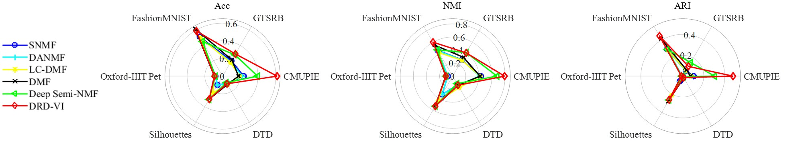

# Anonymous Submission for ICML 2025

This repository contains the code and experiments for our anonymous ICML 2025 submission titled:

**"Multilayer Matrix Factorization via Dimension-Reducing
Diffusion Variational Inference"**

> **Note:** This repository is intended solely for reviewer access during the peer review process. Please do not cite or share this repository publicly until the review process is complete.

---

Main results of abundance estimation

**Table: MSE results of abundance estimation (the best MSE among 10 independent trials / standard deviation).**

| Dataset | Endmember | SISAL     | PRISM     | CNNAEU    | MiSiCNet  | VASCA     | DRD-VI       |
|---------|-----------|-----------|-----------|-----------|-----------|-----------|--------------|
| **Samson** | Soil      | 0.387/0.00 | 0.426/0.21 | 0.410/0.11 | 0.351/0.00 | 0.408/0.25 | **0.269/0.01** |
|         | Tree      | 0.494/0.00 | 0.630/0.22 | 0.469/0.07 | 0.335/0.00 | 0.380/0.09 | **0.314/0.01** |
|         | Water     | 0.785/0.00 | 0.882/0.12 | 0.480/0.14 | 0.697/0.00 | 0.416/0.10 | **0.401/0.01** |
|         | **Avg. MSE** | 0.555/0.00 | 0.646/0.13 | 0.453/0.08 | 0.461/0.00 | 0.401/0.14 | **0.328/0.00** |
| **Jasper** | Tree      | 0.432/0.00 | 0.498/0.14 | 0.450/0.13 | **0.190/0.00** | 0.469/0.05 | 0.275/0.01 |
|         | Water     | 0.457/0.00 | **0.142/0.28** | 0.266/0.07 | 0.214/0.00 | 0.575/0.02 | 0.220/0.08 |
|         | Soil      | 0.605/0.01 | 0.597/0.25 | 0.872/0.14 | 0.578/0.00 | 0.696/0.10 | **0.297/0.05** |
|         | Road      | 0.569/0.00 | 0.570/0.15 | 1.079/0.16 | 1.093/0.00 | 0.794/0.22 | **0.428/0.23** |
|         | **Avg. MSE** | 0.516/0.00 | 0.452/0.15 | 0.667/0.08 | 0.518/0.00 | 0.634/0.05 | **0.305/0.09** |
| **Apex** | Road      | 0.911/0.00 | 1.173/0.29 | 1.596/0.29 | **0.648/0.00** | 1.022/0.08 | 0.978/0.04 |
|         | Tree      | 0.543/0.00 | 0.488/0.13 | 0.567/0.09 | **0.255/0.00** | 0.387/0.08 | 0.369/0.02 |
|         | Roof      | 0.664/0.00 | 0.427/0.15 | 0.615/0.09 | **0.299/0.00** | 0.619/0.05 | 0.389/0.02 |
|         | Water     | 0.853/0.01 | 0.491/0.22 | 0.471/0.15 | **0.452/0.00** | 0.503/0.09 | 0.698/0.01 |
|         | **Avg. MSE** | 0.743/0.00 | 0.645/0.15 | 0.812/0.06 | **0.413/0.00** | 0.633/0.05 | 0.609/0.02 |
| **Urban** | Asphalt   | 0.816/0.02 | 0.923/0.17 | 0.626/0.10 | **0.539/0.00** | 0.720/0.07 | 0.617/0.05 |
|         | Grass     | 0.659/0.04 | 0.549/0.17 | 0.590/0.07 | 0.515/0.00 | 0.538/0.06 | **0.480/0.04** |
|         | Tree      | 0.668/0.03 | **0.468/0.21** | 0.496/0.07 | 0.587/0.00 | 0.695/0.08 | 0.542/0.01 |
|         | Roof      | 1.004/0.11 | 1.024/0.45 | 0.581/0.09 | 0.638/0.00 | 0.895/0.09 | **0.566/0.01** |
|         | Metal     | **0.907/0.05** | 1.016/0.21 | 0.977/0.71 | 2.823/0.00 | 0.979/0.10 | 1.337/0.14 |
|         | Dirt      | 0.722/0.06 | 0.963/0.11 | 0.927/0.24 | 0.626/0.00 | 0.883/0.07 | **0.517/0.04** |
|         | **Avg. MSE** | 0.796/0.02 | 0.824/0.12 | 0.700/0.12 | 0.955/0.00 | 0.785/0.03 | **0.677/0.04** |

Main results of low-dimensional representation learning

**Performance comparison of the MF and MMF methods across the six datasets. The latent space dimensions equal $16$ for gray image datasets and $16\times3$ for color ones.**

